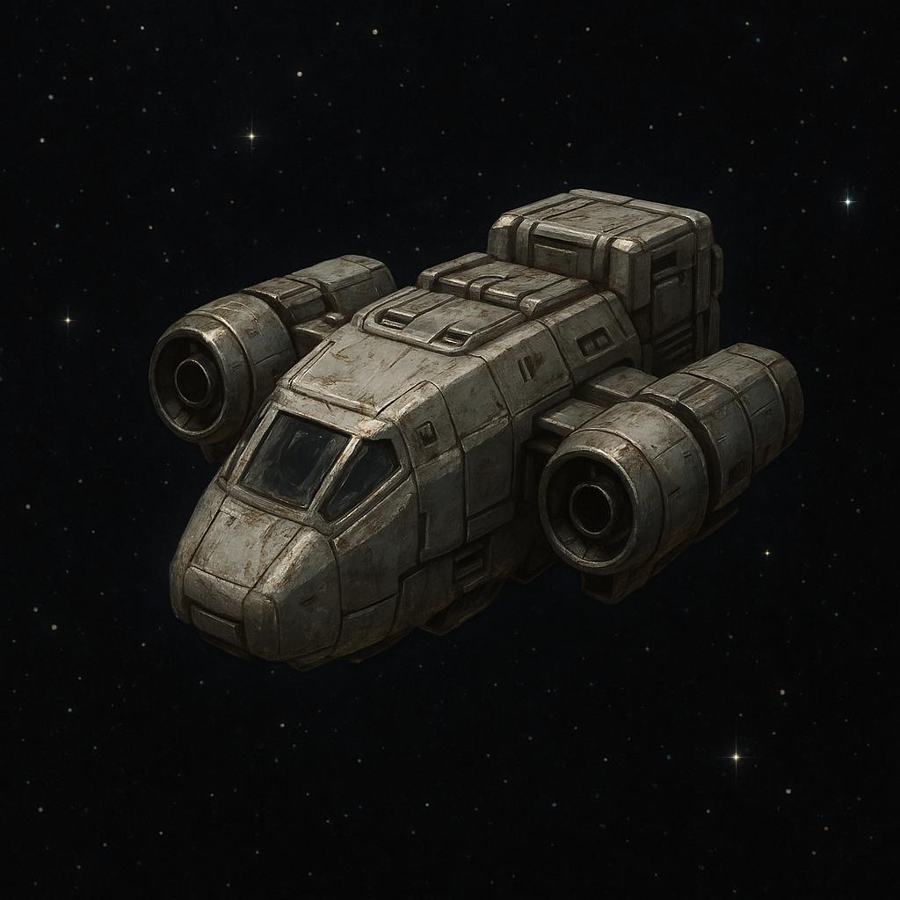

# Trade Wars

A fully on-chain, interplanetary trading game.

Set in a post-apocalyptic future, Trade Wars challenges players to rebuild civilization across the stars through trading, colonization, and resource management. Each player begins on a planet with limited production capabilities and must interact with other players and The Company (a centralized in-game authority) to acquire fuel (Nova) and essential resources.

