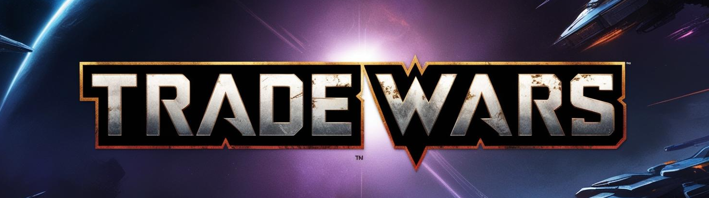

# Trade Wars  
Massively multiplayer. Fully on-chain. Surprisingly fun. Only on Sui.

**tl;dr?** A strategy game where trading is king—and blockchain actually makes it better.  
[No gimmicks. No NFT spam. Just gameplay.](#empowered-by-blockchain-built-to-be-fun)

## In the vast darkness of the far future, there is only trade  
Humanity nearly drove itself to extinction during the Last War. Ironically, it was a war invention—Nova, the ultimate fuel enabling fast interplanetary travel—that allowed the last remnants of humanity to leave the Ruined Earth and begin settling other planets. The Company, creators of Nova, retained a monopoly over it, securing tribute from the flourishing human empires born from interstellar expansion. By controlling Nova production, the Company enforces interdependence among the stars, mandating that all planets trade with one another. In doing so, it preserves peace by binding humanity together under the only god it has consistently worshipped: trade.

## Gameplay

In *Trade Wars*, you play as an Overseer — the leader of a growing interplanetary empire. Your primary tasks include:

- **Collecting** resources generated by your planets  
- **Upgrading** infrastructure to improve output and efficiency  
- **Trading** with the Company to acquire Nova — the fuel required for interplanetary travel  

Nova is essential for expanding your empire and accessing resources unavailable on your current planets.

### The Trade System

The Company enforces universal trade. Under its regulations:

- Every planet **must sell** resources if a buyer offers at least the **Company Rate** — a dynamic, minimum exchange rate set for each resource pair.  
- Planets may list cheaper prices, but **cannot refuse** trades made at the Company Rate.  
- The Company Rate is not fixed — it evolves over time based on the Company’s own trading activity with players, reflecting supply and demand across the galaxy.

This creates a dual-market system: open offers between players, and guaranteed trade routes under the Company’s control.

### Executing a Trade

There are two main trade types in *Trade Wars*:

#### Regular Trades

- Players can **create trade offers** at will by specifying:
  - The resource and quantity they are offering  
  - The resource they want in return  
  - Their desired exchange rate  
- Once an offer is placed:
  - The offered resources are **locked** and cannot be used for other offers, upgrades, or operations.  
- Other players browsing the market can evaluate and accept these offers, considering:
  - **Distance** between planets  
  - **Travel time**  
  - **Nova (fuel) cost** of the round trip  
- Upon acceptance, the buyer sends a cargo fleet to complete the trade.

#### Compliance Trades

A **Compliance Trade** occurs when a player unilaterally enforces a transaction at the Company Rate.

- The buyer sends a cargo fleet to a target planet, carrying:
  - A **maximum quantity** of the resource they wish to acquire  
  - The required **payment resource**, valued at the **Company Rate effective upon arrival**  
- The seller planet **cannot refuse** the trade if the price condition is met, but the transaction will only succeed if the target still has the requested resources when the ships arrive.  
- Importantly, the **Company Rate is checked at the moment the ships arrive**, not when they are launched. This introduces risk — if the rate changes in transit, the amount the buyer brought may no longer be sufficient to complete the trade.  
- Until the fleet lands, the target planet can intentionally deplete reserves to avoid the trade by:
  - Spend the resources on upgrades
  - Take other offers

Because Compliance Trades cannot be blocked, they serve as a **failsafe** to prevent price gouging — but they also carry risk. If the seller spends the goods or the rate shifts unfavorably, the trade fails, and Nova is wasted.

As a result:

- **Voluntary trades** are often priced below the Company Rate to attract buyers and avoid being bypassed.  
- In high-demand cases, buyers may offer **above** the Company Rate to guarantee success and avoid the uncertainty of a Compliance Trade.

In both trade types, the **buyer pays the full Nova cost** for the round trip, regardless of success or failure.

## Empowered by Blockchain, Built to Be Fun

*Trade Wars* isn’t a blockchain game with a leaderboard slapped on top. It’s a full, classic resource-management strategy game—designed from the ground up to take advantage of what blockchain actually does well.

At the center of the game is your **Overseer**: a smart contract object stored in your wallet that represents your empire's progress. Since it's yours, you can keep it, upgrade it, or even trade it—without relying on shady password deals or off-chain accounts. Thanks to Sui’s Kiosk system, the game itself can benefit from those transfers, keeping incentives aligned.

All player-gathered resources use Sui's **Coin** standard, treating them like real digital assets. Nova, the rare fuel needed for expansion and interstellar trade, is also a Coin—but behaves more like a premium resource. This system gives players more control over their strategy and introduces just a bit of that Web3 degen energy (in a good way).

And it doesn’t stop at assets.

Thanks to Sui’s unique smart contract capabilities, *anyone* can spin up a new **Universe**—effectively a standalone game server—on-chain. This opens up huge possibilities for player communities, streamers, DAOs, or guilds to run their own versions of the game, with their own local economies and player bases. Meanwhile, game admins can adjust global settings across all Universes to ensure long-term balance and playability.

Let’s be clear: **it’s all on-chain**. No centralized servers. No traditional backend. Just:

- Smart contracts on Sui  
- A React frontend for players  
- A CLI for admins  

*Trade Wars* exists to explore what happens when you give players true digital ownership and make smart contracts the core of a game—not a gimmick. No NFT-PFP cash grabs here. Just real gameplay, powered by tech that fits it perfectly.

## Project Scope

*Trade Wars* was created for the **Sui Hackathon 2025** and is currently at a **POC/MVP stage**.

### ✅ Available Features

1. **Admin**: Create new Universes (on-chain game instances)  
2. **Players**: Join *Trade Wars* and receive their unique Overseer object  
3. **Players**: Join a Universe  
4. **Players**: Use gathered resources to upgrade resource mines

### 🛠 Upcoming Features

1. Trade resources with the Company in exchange for Nova  
2. Create and accept direct trade offers with other players  
3. Perform **Compliance Trades** (enforced trades at the Company Rate)

### 📈 Feature Upgrades (Planned)

1. **Planet Size Limits**  
   - Planets have a max size  
   - Each building level consumes space  
   - Adds strategic constraints to development

2. **Resource Storage Limits**  
   - Each planet has storage buildings  
   - If capacity is reached, production halts  
   - Encourages timely trading and expansion

3. **Spaceship Factories**  
   - Limit the volume of resources in trades based on available ships  
   - Players must build and maintain fleets to trade efficiently

4. **Research Lab**  
   - Players can spend resources to unlock tech upgrades  
   - Example bonuses: faster ships, cheaper construction, etc.
