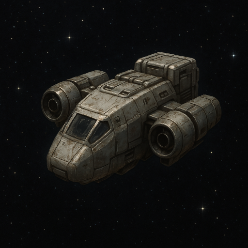

# Trade Wars  
The on-chain, massively multiplayer trading strategy game. Only on Sui.

**tl;dr?** A truly fun game that just happens to be built on a blockchain.  
[This isn't your regular NFT game.](#empowered-by-blockchain-built-to-be-fun)

## In the vast darkness of the far future, there is only trade  
Humanity nearly drove itself to extinction during the Last War. Ironically, it was a war invention—Nova, the ultimate fuel enabling fast interplanetary travel—that allowed the last remnants of humanity to leave the Ruined Earth and begin settling other planets. The Company, creators of Nova, retained a monopoly over it, securing tribute from the flourishing human empires born from interstellar expansion. By controlling Nova production, the Company enforces interdependence among the stars, mandating that all planets trade with one another. In doing so, it preserves peace by binding humanity together under the only god it has consistently worshipped: trade.

## Gameplay  
In *Trade Wars*, you play as an Overseer—the ruler of an expanding interplanetary empire. Gather resources produced by your planets, invest them to upgrade your infrastructure, and trade with the Company to obtain Nova. Nova enables you to reach and trade with other planets, acquiring the resources your empire needs to thrive.

## Empowered by blockchain, built to be fun  
Blockchain gives players full control over their game progress, represented by their *Overseer* object stored directly in their wallet. They can potentially trade this object, letting them benefit from the effort they’ve put into the game, without shady account/password exchanges.  
Thanks to Sui’s Kiosk design, *Trade Wars* itself can even benefit from those trades.  
The game uses Sui's Coin standard in an innovative way to represent player-gathered resources, and in a more traditional way for Nova—allowing players to accelerate their progress and bringing just a touch of Web3 degen vibes into the game.  
But there’s more. The unique smart contract architecture—enabled by Sui’s capabilities—lets anyone create a Universe (effectively a game server). This opens the door for communities to host their own versions of the game while supporting thousands of players in real-time. At the same time, game admins can adjust global parameters across all Universes to ensure long-term playability and balance.  
Let me emphasize this: *it’s all on-chain*. There’s no traditional backend, just smart contracts, a React-based client for players, and a lightweight CLI for admin tasks.  
This project aims to explore and demonstrate how smart contracts can unlock new possibilities in game development. No NFT-PFP gimmicks forced into low-quality browser games—just a classic resource management game using a technology that fits it perfectly.

### Project scope  
This game was created for the **Sui Hackathon 2025**, and is currently at a POC/MVP stage.

#### Available features  
1. Admin: create new Universes
1. Players: join Trade Wars (get their overseer object)
1. Players: join Universe
1. Players: use resources to upgrade resource mines

#### Upcoming features  
1. Trade resources with the game in exchange for Nova  
1. Trade resources directly with other players
